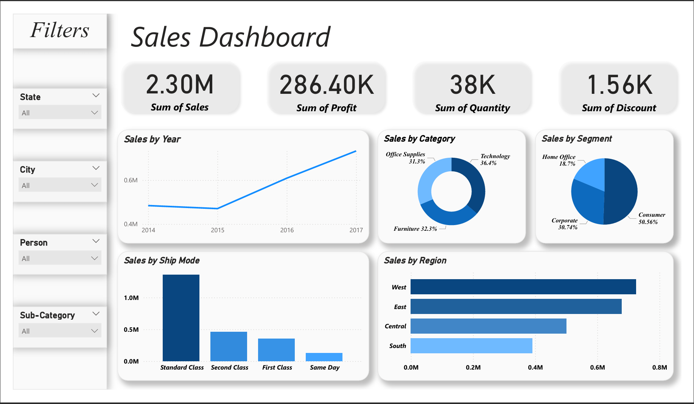

# Power BI Sales Dashboard

A professional, real-world style dashboard created with Power BI as part of a hands-on analytics training experience.

This dashboard is designed to help businesses monitor and analyze their sales performance through clean, interactive, and insightful visuals.

## Dashboard Preview

## Project Overview

This Power BI dashboard includes:

- KPI Cards for Sales, Profit, Quantity, and Discount
- Interactive filters for Region, Segment, City, Sub-category, and Shipping Mode
- Year-over-year trend analysis with dynamic line charts
- A clean and user-friendly layout to support quick business decisions

This project was built during a training project focused on applying data analytics to simulate real-world business needs.

## Tools and Skills Used

- Microsoft Power BI  
- DAX (Data Analysis Expressions)  
- Data Modeling  
- Data Cleaning  
- Data Visualization  
- Business Intelligence Concepts  

## Files Included

- `dashboard.png` – Snapshot of the dashboard  
- `dashboard.pdf` – Printable version of the dashboard preview  
- README file (this one)  

Note: The `.pbix` file is not included to maintain data privacy.

## Use Case

This dashboard template is ideal for:

- Small and medium businesses tracking performance  
- Sales teams monitoring key metrics  
- Anyone looking to develop interactive dashboards with real impact

## Connect with Me

If you’re interested in similar dashboards or data analytics services, feel free to reach out or connect:

[LinkedIn – Yousif Ahmed](https://www.linkedin.com/in/yousif-ahmed-ibrahim/)
